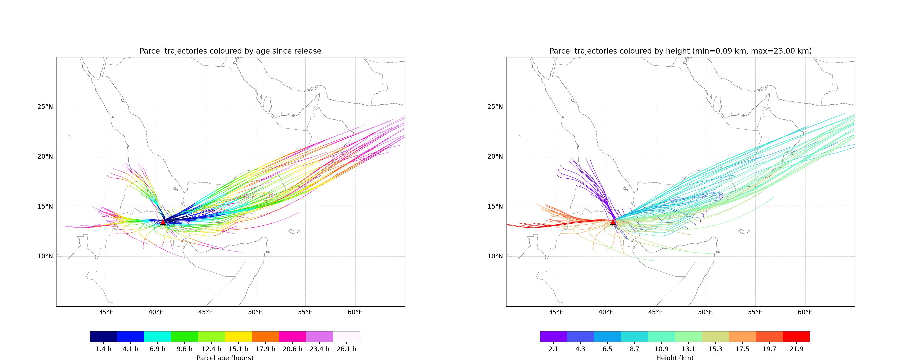

# Forward Trajectory Tool (`plume_forwtraj.py`)

This script releases a vertical column of parcels from one or more WRF grid cells and advects them **forward in time** using 3-D WRF winds. It stops parcels when they leave the model domain (sides, top, or bottom) and produces two trajectory maps:

- **Height-colored trajectories** (parcel height along the path)
- **Age-colored trajectories** (hours since release)
- **Optional hourly parcel-location snapshots** (maps at each whole hour since release)

It also supports saving a state pickle for later re-plotting with `plot_forwtraj.py`.


Aggregated forward trajectories for ash (vash_6-vash_10), colored by age (left) and height (right).
---

## 1. Dependencies

Install these Python packages:

- `numpy`
- `scipy`
- `netCDF4`
- `matplotlib`
- `cartopy`

Example (conda):

```bash
conda install numpy scipy netcdf4 matplotlib cartopy
```

or with `pip`:

```bash
pip install numpy scipy netCDF4 matplotlib cartopy
```

---

## 2. Required Inputs

### 2.1 WRF output (`--input`)

One or more WRF NetCDF files containing:

- `XLAT`, `XLONG`
- `MAPFAC_MX`, `MAPFAC_MY`, `DX`, `DY`
- `U`, `V`, `W`
- `PH`, `PHB`
- `Times`

You can pass multiple files in time order, or a wildcard pattern such as:

```
--input wrfout_d01_2025-11*
```

### 2.2 MPAS history files (`--target mpas`)

When `--target mpas` is selected, `--input` should point to one or more MPAS history files. The backend reads:

- `latCell`, `lonCell`
- `zgrid`
- `uReconstructZonal`, `uReconstructMeridional`
- `w`

Example:

```bash
--target mpas --input history.2025-11-24_*.nc
```

In MPAS mode, forward release supports:

- a single nearest-cell source via `--source-lat` / `--source-lon`, or
- random source columns inside `--seed-bbox` with `--n-columns` (non-emission-matrix mode).

When `--emission-matrix` is used, MPAS forward still uses `--source-lat` / `--source-lon` as the source location.

---

## 3. Command-line Arguments

Basic run:

```bash
python plume_forwtraj.py \
  --input wrfout_d01_2025-11* \
  --start-time 2025-11-23T08:30:00 \
  --end-time 2025-11-24T12:00:00 \
  --source-lat 13.51 \
  --source-lon 40.71 \
  --z-min 1000 \
  --z-max 23000 \
  --n-vert 30
```

Full argument list:

- `--input` (required, one or more)  
  WRF output file(s). Wildcards are supported.

- `--start-time`, `--end-time` (required)  
  UTC start/end time, e.g. `2021-04-10T18:00:00` or `2021-04-10_18:00:00`.  
  No timezone conversion is applied by the script; values must use the same time basis as WRF `Times` (normally UTC).

- `--source-lat`, `--source-lon` (required unless `--seed-bbox`)  
  Release location (column center), in degrees.

- `--seed-bbox LON_MIN LAT_MIN LON_MAX LAT_MAX` (optional)  
  Restrict the release to random grid cells inside this lon/lat box (WRF and MPAS, non-emission-matrix mode).

- `--n-columns` (default: `1`)  
  Number of random grid cells sampled inside `--seed-bbox` (WRF and MPAS, non-emission-matrix mode).

- `--n-vert` (default: `30`)  
  Number of parcels along each release column.

- `--z-min`, `--z-max` (default: `2000`, `25000`)  
  Vertical range (m) of release heights.

- `--emission-matrix` (optional)  
  Path to a time-height release matrix file. Recommended first line is `time_offset_h ...` (hours from `--start-time`) or `time_offset_s ...` (seconds from `--start-time`). Legacy `time ...` is also accepted.

- `--integration-dt` (default: `15`)  
  Forward advection sub-step in seconds.

- `--aer-type` (optional)  
  Aerosol type for gravitational settling (keys in `SETTLING_VEL_MS`).  
  If omitted, parcels are treated as passive tracers with no gravitational settling (WRF and MPAS).

- `--initial-height-figure` (default: `parcel_initial_heights.png`)  
  Output PNG for trajectories coloured by parcel height.

- `--age-figure` (default: `parcel_ages.png`)  
  Output PNG for trajectories coloured by parcel age since release.

- `--deposition-figure` (optional)  
  Output PNG for deposited parcels only, coloured by deposition hour since release.

- `--seeds-vertical-figure` (optional)  
  Output PNG for the initial vertical parcel distribution.

- `--hourly-output-dir` (optional)  
  If provided, save parcel-location maps at each whole hour since release into this output directory.

- `--figure-dpi` (default: `200`)  
  DPI used for all figures.

- `--map-extent WEST SOUTH EAST NORTH` (optional)  
  Override the map extent for all plots (west/south/east/north bounds). If omitted, the WRF domain bounds are used.

- `--state-pickle` (optional)  
  Path for a pickle file storing inputs and trajectories for re-plotting.

---

### 3.1 Emission-Matrix Format and Override Rules

Expected matrix text layout:

1. First non-empty line: time header  
   - recommended: `time_offset_h t1 t2 ...` or `time_offset_s t1 t2 ...`
   - legacy accepted: `time t1 t2 ...`
2. Second non-empty line: `height h1 h2 ...`
3. Remaining lines: matrix values, one row per height, ordered from highest height row to lowest height row.

Matrix behavior:

- Native matrix mode (`--emission-matrix` only):
  - times, heights, and counts are taken from the matrix file.
- Override mode (`--emission-matrix` plus all of `--z-min --z-max --n-vert`):
  - matrix times are used
  - matrix heights and counts are ignored
  - heights are rebuilt from `z-min..z-max` with `n-vert` levels
  - one parcel is released per `(time, height)` cell.

---

## 7. Compact Run Sheet

```bash
# WRF-Chem
python plume_forwtraj.py \
  --target wrf \
  --input wrfout_d01_2025-11* \
  --start-time 2025-11-23T08:30:00 \
  --end-time 2025-11-24T12:00:00 \
  --source-lat 13.51 \
  --source-lon 40.71 \
  --state-pickle forward_run.pkl

# MPAS-Chem
python plume_forwtraj.py \
  --target mpas \
  --input history.2025-11-24_*.nc \
  --start-time 2025-11-23T08:30:00 \
  --end-time 2025-11-24T12:00:00 \
  --source-lat 13.51 \
  --source-lon 40.71 \
  --state-pickle forward_run.pkl
```

---

## 4. Outputs

The script writes:

- A height-colored trajectory map (`--initial-height-figure`)
- An age-colored trajectory map (`--age-figure`)
- Optional deposited-parcel map colored by deposition hour (`--deposition-figure`)
- Optional initial vertical distribution (`--seeds-vertical-figure`)
- Optional hourly parcel-location maps (`--hourly-output-dir`)
- Optional pickle file (`--state-pickle`)

In WRF forward plots, `--seed-bbox` is drawn as an outline on maps.
Hourly maps use the nearest available trajectory snapshot to each whole hour.

---

## 5. Re-plotting from a saved state

Use the helper script `plot_forwtraj.py`:

```bash
python plot_forwtraj.py forward_run.pkl
```

Optional overrides:

```bash
python plot_forwtraj.py forward_run.pkl \
  --initial-height-figure plume_height_colored_replot.png \
  --age-figure plume_age_colored_replot.png \
  --deposition-figure deposited_parcels_by_hour_replot.png \
  --seeds-vertical-figure seeds_vertical_replot.png \
  --hourly-output-dir ./hourly_maps_replot
```

Replot helper options now include:

- `--hourly-output-dir` to regenerate hourly parcel-location maps from the saved state and control where hourly images are written.
- `--deposition-figure` to save only deposited parcels colored by deposition hour.

---

## 6. Example Commands

### Minimal forward run

```bash
python plume_forwtraj.py \
  --input wrfout_d01_2025-11* \
  --start-time 2025-11-23T08:30:00 \
  --end-time 2025-11-24T12:00:00 \
  --source-lat 13.51 \
  --source-lon 40.71 \
  --z-min 1000 \
  --z-max 23000 \
  --n-vert 30
```

### Single source point

```bash
python plume_forwtraj.py \
  --input wrfout_d01_2025-11* \
  --start-time 2025-11-23T08:30:00 \
  --end-time 2025-11-24T12:00:00 \
  --source-lat 13.51 \
  --source-lon 40.71 \
  --z-min 1000 \
  --z-max 23000 \
  --n-vert 30 \
  --initial-height-figure plume_height_colored.png \
  --age-figure plume_age_colored.png \
  --seeds-vertical-figure parcel_initial_vertical_distribution.png \
  --state-pickle forward_run.pkl
```

### Random columns inside a bbox

```bash
python plume_forwtraj.py \
  --input wrfout_d01_2025-11* \
  --start-time 2025-11-23T08:30:00 \
  --end-time 2025-11-24T12:00:00 \
  --seed-bbox 40.0 10.0 40.1 10.1 \
  --n-columns 25 \
  --z-min 1000 \
  --z-max 23000 \
  --n-vert 30
```

### MPAS random columns inside a bbox

```bash
python plume_forwtraj.py \
  --target mpas \
  --input history.2025-11-24_*.nc \
  --start-time 2025-11-23T08:30:00 \
  --end-time 2025-11-24T12:00:00 \
  --seed-bbox 40.0 10.0 40.1 10.1 \
  --n-columns 25 \
  --z-min 1000 \
  --z-max 23000 \
  --n-vert 30
```

### Aerosol settling enabled

```bash
python plume_forwtraj.py \
  --input wrfout_d01_2025-11* \
  --start-time 2025-11-23T08:30:00 \
  --end-time 2025-11-24T12:00:00 \
  --source-lat 13.51 \
  --source-lon 40.71 \
  --z-min 1000 \
  --z-max 23000 \
  --n-vert 30 \
  --aer-type sulf
```

### Hourly snapshot output

```bash
python plume_forwtraj.py \
  --input wrfout_d01_2025-11* \
  --start-time 2025-11-23T08:30:00 \
  --end-time 2025-11-24T12:00:00 \
  --source-lat 13.51 \
  --source-lon 40.71 \
  --z-min 1000 \
  --z-max 23000 \
  --n-vert 30 \
  --hourly-output-dir ./hourly_maps
```

---

## 7. Notes on Input Data

- Make sure all WRF files are on the same grid (same `XLAT/XLONG`, `DX/DY`, and map factors).
- When using multiple WRF files, pass them in chronological order or use a wildcard that sorts in time.
- `--start-time` and `--end-time` must fall inside the selected backend time range (WRF or MPAS); the script uses the closest available model times and warns if the request is more than 1 minute away.
- No timezone conversion is applied to CLI time strings; pass times in the same basis as WRF `Times` (normally UTC).

---

## 8. Troubleshooting

- **No parcels advecting**: check that `--start-time` is within the WRF time range and that `--z-min/--z-max` are below the model top.
- **Cartopy errors**: install `cartopy` with conda if pip wheels are not available for your system.
